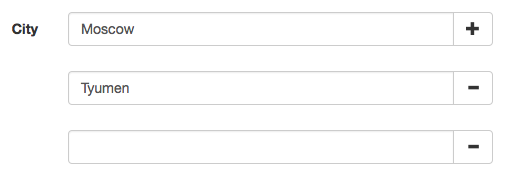

yii2-dynamic-fields
==================
Widget for display dynamic fields, adding and removing their use Pjax.



Installation
------------

The preferred way to install this extension is through [composer](http://getcomposer.org/download/).

Either run

```
php composer.phar require --prefer-dist bupy7/yii2-dynamic-fields "*"
```

or add

```
"bupy7/yii2-dynamic-fields": "*"
```

to the require section of your `composer.json` file.


Usage
-----

Add following code to your view:

```php
use yii\helpers\Html;
use yii\widgets\ActiveForm;
use bupy7\dynafields\DynaFields;

$form = ActiveForm::begin(['action' => ['index']]);

echo DynaFields::widget([
    'urlAdd' => ['your-action-add'],
    'urlRemove' => ['your-action-remove'],
    'inputMethod' => 'textInput',
    'inputMethodArgs' => [['maxlength' => true]],
    'form' => $form,
    'models' => $models,
    'attribute' => 'attribute',
]);

echo Html::submitButton('Save', ['class' => 'btn btn-success']);

ActiveForm::end();
```

Added following code to your controller:

```php
use Yii;
use yii\base\Model;

/**
 * Render form.
 */
public function actionIndex() 
{
    $models = ModelName::find()->all();
    if (Model::loadMultiple($models, Yii::$app->request->post()) && Model::validateMultiple($models)) {
        for ($i = 0; $i != count($models); $i++) {
            $models[$i]->save(false);
        }
        return $this->redirect(['index']);
    }
    return $this->render('index', ['models' => $models]); 
}

/**
 * Create new model.
 */
public function actionYourActionAdd()
{ 
    $model = new ModelName;
    $model->save(false);
    return $this->actionIndex();
}

/**
 * Delete model.
 * @param int $id
 */
public function actionYourActionRemove($id)
{
    ModelName::findOne($id)->delete();
    return $this->actionIndex();
}
```

##License

yii2-dynamic-fields is released under the BSD 3-Clause License.
